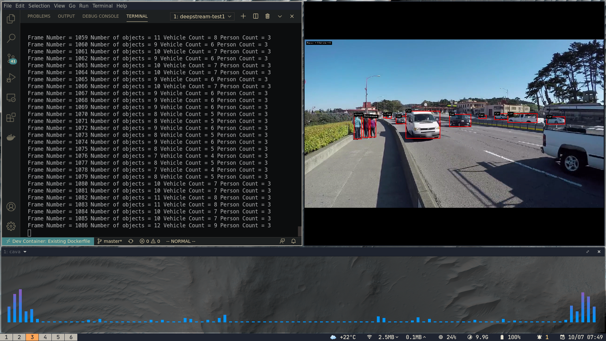
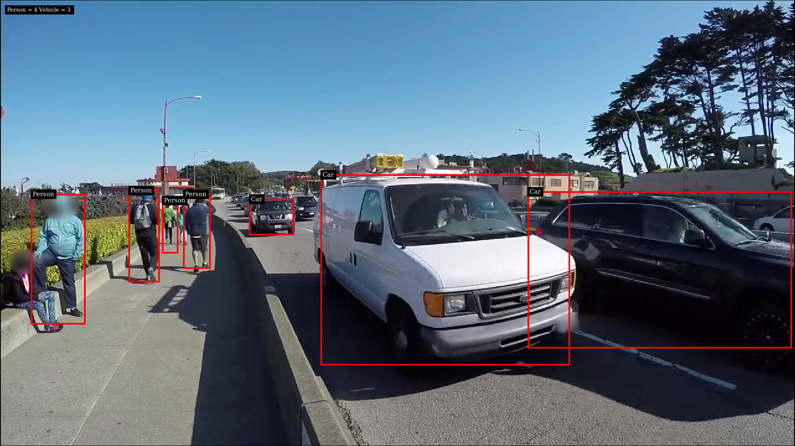

# single inference

This example uses a 4-class detector `dstest1_pgie_config.txt`

This is our 4 class detector and it detects for

- Vehicle
- RoadSign
- TwoWheeler
- Person

Usage `./deepstream-test1-app /opt/nvidia/deepstream/deepstream-5.0/samples/streams/sample_720p.h264`

## Screenshots

