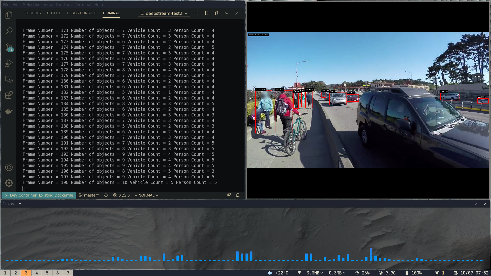
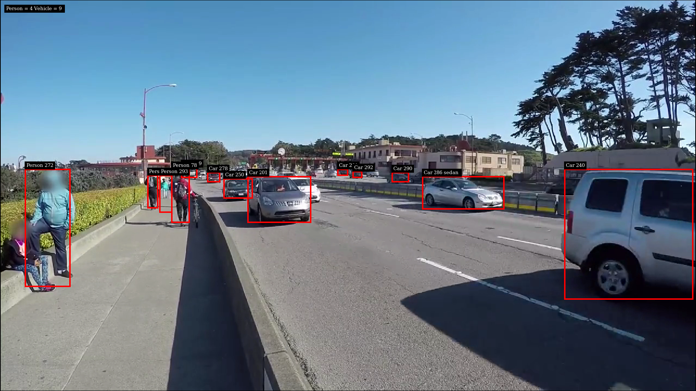

# multiple-tracking

This example uses multiple inferencing, first uses primary 4 class detector, the subsequent inferencing detects the vehicle color, make and type

`filesrc→ decode→ nvstreammux→ nvinfer (primary detector)→ nvtracker→ nvinfer (secondary classifier)→ nvdsosd → renderer`

For reference, here are the config files used for this sample :
1. The 4-class detector (referred to as pgie in this sample) uses
    dstest2_pgie_config.txt
2. The vehicle color classifier (referred to as sgie1 in this sample) uses
    dstest2_sgie1_config.txt
3. The vehicle make classifier (referred to as sgie2 in this sample) uses
    dstest2_sgie2_config.txt
4. The vehicle type classifier (referred to as sgie3 in this sample) uses
    dstest2_sgie3_config.txt
5. The tracker (referred to as nvtracker in this sample) uses
    dstest2_tracker_config.txt

## Screenshots

